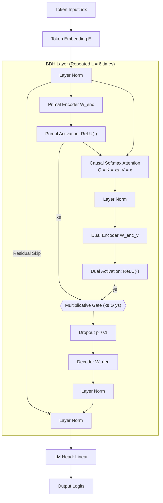
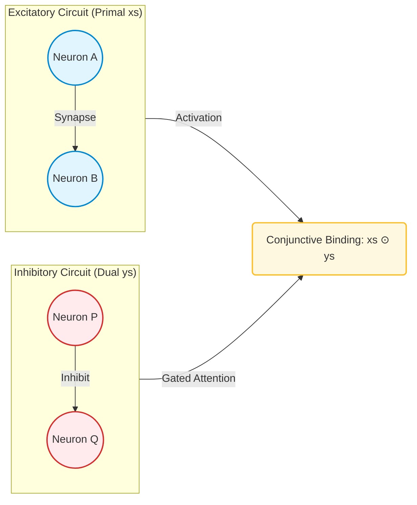
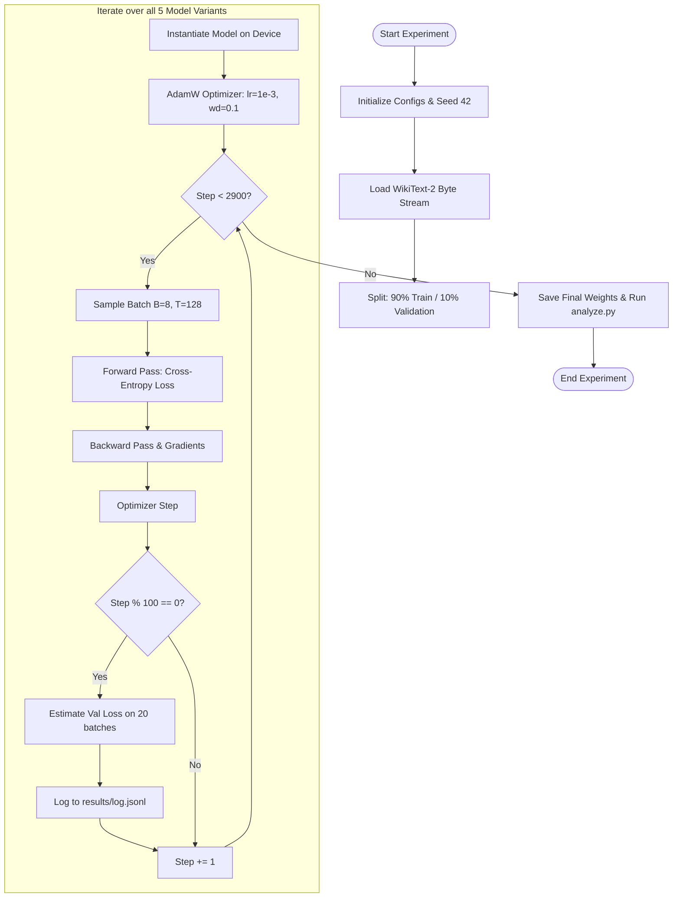

# BDH-Ablations: Component-Level Analysis of the Dragon Hatchling Language Model

[](https://opensource.org/licenses/MIT)
[](https://www.python.org/downloads/)
[](https://pytorch.org/)

This repository presents a controlled, component-level ablation study of the **Baby Dragon Hatchling (BDH)** architecture on byte-level WikiText-2 language modeling. The goal of this research is to isolate and quantify the representational importance of BDH’s core bio-inspired features.

---

## 📖 Research Abstract

The Dragon Hatchling (BDH) (Kosowski et al., arXiv:2509.26507) is a biologically-inspired sequence modeling architecture. It replaces standard Multi-Head Attention (MHA) and Feed-Forward Networks (FFN) with a dual-circuit state-space model that implements integrate-and-fire activation thresholding, Hebbian synaptic learning rules, and multiplicative concept binding.

While the original paper demonstrates that BDH scales competitively with GPT-2, the individual contribution of each core component has not been systematically isolated. This project addresses this gap through a controlled ablation study across four key dimensions:
1. **Multiplicative Conjunction Gate ($\odot$):** Evaluated against an additive alternative ($+$).
2. **Latent Space Dimensionality ($m$):** Evaluated at the default $m=128$ vs. a compressed $m=32$.
3. **Activation Non-Linearity:** Comparing biologically-plausible, exact-sparsity ReLU vs. smooth GELU.
4. **Attention Loop Representation:** Checked against a parameter-matched Transformer baseline.

---

## 🎨 Architectural Framework & Diagrams

### 1. Single Layer BDH Forward Pass
The following diagram maps the computational graph of one BDH-GPU layer. The central innovation is the **Multiplicative Gate** (logical AND) combining the primal sparse pathway (content encoding) and the dual sparse pathway (context/attention modulated).



---

### 2. Biological Circuits Analogy
BDH translates classical biological neural behavior into matrix operations. 
*   **Primal branch ($x_s$):** Excitatory neural assemblies responding directly to the stimulus.
*   **Dual branch ($y_s$):** Attention-gated inhibitory neural assemblies providing context-specific feedback.
*   **Product ($x_s \odot y_s$):** Co-activation of both circuits representing conjunctive concept binding (logical AND).
*   **Synaptic Matrix ($S_t$):** The linear attention matrix mimics Hebbian long-term potentiation: connections strengthen when neurons fire together.



---

### 3. Training & Evaluation Pipeline Flowchart
The following diagram maps the execution pipeline of the experiment runner:



---

## 🧪 Experimental Configurations

| Architecture | Interaction | Activation | Mult. ($m$) | Latent Dim ($N$) | Description |
| :--- | :---: | :---: | :---: | :---: | :--- |
| **Transformer** | — | GELU | — | — | Standard Multi-Head Attention & FFN |
| **BDH Base** | Multiplication ($\odot$) | ReLU | 128 | 8,192 | Standard BDH-GPU implementation |
| **BDH-NoMul** | Addition ($+$) | ReLU | 128 | 8,192 | Ablation: Replaces $\odot$ with linear blending |
| **BDH-LowDim** | Multiplication ($\odot$) | ReLU | 32 | 2,048 | Ablation: Compresses latent dimension by 4x |
| **BDH-Improved**| Multiplication ($\odot$) | GELU | 128 | 8,192 | Ablation: Soft non-linearity replaces hard ReLU |

---

## 📈 Quantitative Findings & Visualizations

After training completed, running `python analyze.py` compiled the training trajectory logs into the following results.

### 1. Training Curves (Loss Trajectories)
*Compare the convergence speed and final cross-entropy loss across all 5 models.*


*   **The Transformer baseline** converges the fastest initially, due to the representational expressiveness of unshared parameters per layer.
*   **BDH-NoMul** (additive interaction) converges the slowest and plateaus at the highest final loss, illustrating that multiplication is vital to its performance.

### 2. Component Impact Study (Ablations)
*Signed $\Delta$ in Average Last-50 Loss compared to BDH Base. Positive values represent performance degradation (hurts the model), while negative values represent improvements.*


*   **Multiplicative Interaction is crucial (+0.059):** Replacing the gate with addition leads to a massive drop in performance. Without multiplication, conjunctive binding collapses.
*   **Latent space compression helps (-0.052):** Reducing the multiplier from $m=128$ to $m=32$ slightly improves perplexity, showing that the base latent space is heavily over-parameterized at this scale.
*   **GELU activation yields minor gains (-0.039):** Replacing ReLU with GELU improves loss by providing smoother gradients, though it forfeits biological interpretability.

---

## 🛠️ Reproduction Guide

### Local Installation
```bash
pip install torch numpy matplotlib datasets
```

### Running the Experiments
```bash
# 1. Run all 5 training runs in sequence (saves to results/log.jsonl)
python -m experiments.runner

# 2. Compile metrics and generate plots
python analyze.py
```

## 📝 BibTeX Citation

```bibtex
@article{khamitkar2026bdh,
  title={BDH Architecture Analysis: A Controlled Component-Level Study of the Dragon Hatchling Language Model},
  author={Khamitkar, Aditya and Jagatap, Tushar and Saini, Nitin},
  year={2026},
  institution={SCAI, VIT Bhopal University}
}
```
